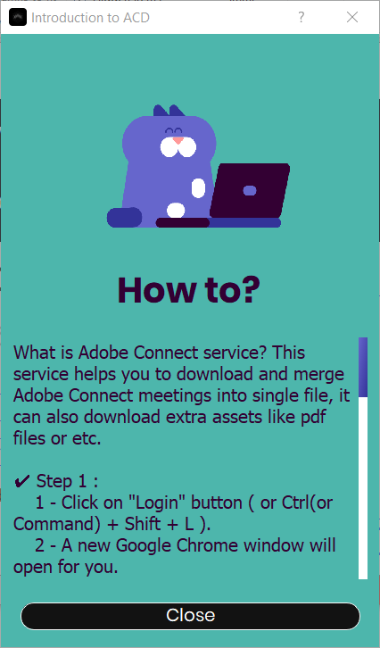
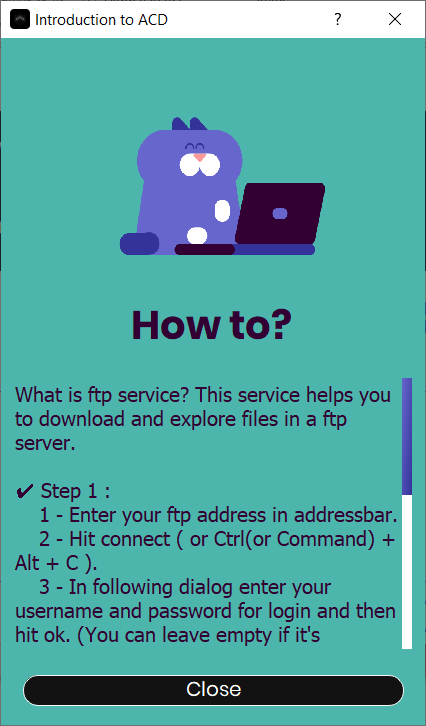
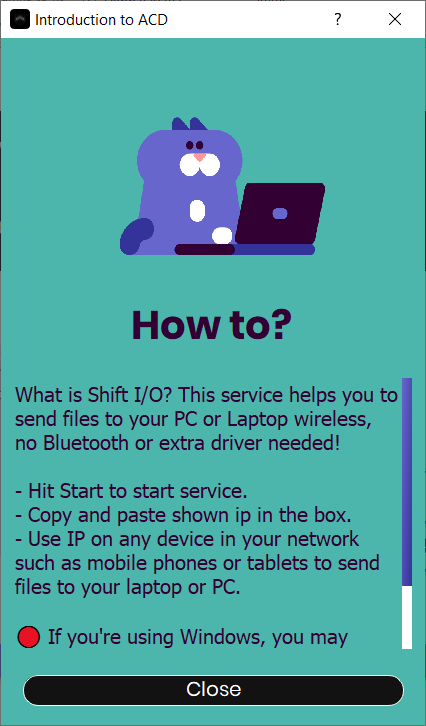
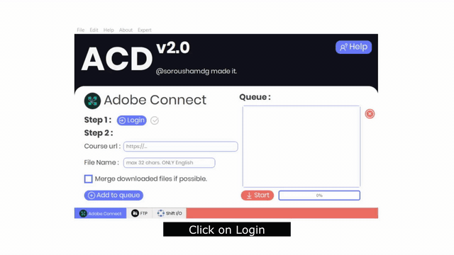
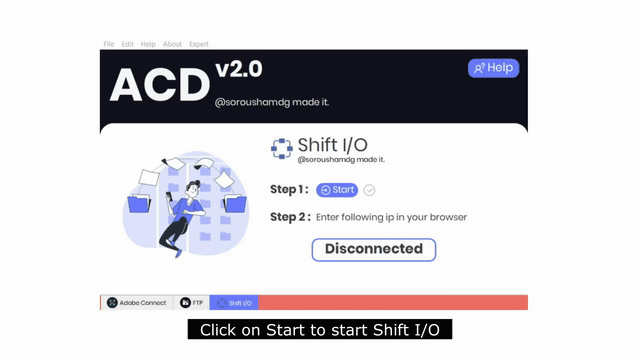

[](https://forthebadge.com)[](https://forthebadge.com)[](https://forthebadge.com)[](https://forthebadge.com)[](https://forthebadge.com) [](https://forthebadge.com)[](https://forthebadge.com)[](https://www.gnu.org/licenses/gpl-3.0)


[](https://github.com/soroushamdg/acd/releases/latest)


### ❓ What was the problem? What is ACD?

ACD solves three main problems that students may face in online courses and online learning during quantine. What I tried to do was packaging some tools to solve those a bit, but still, there is a lot more to fix.

- Adobe Connect Classes : As most public schools and universities can't afford fast and powerful servers to host Adobe Connect meetings, they lack one main feature, exporting meetings for offline usage. So students(including me) couldn't download courses and had to watch them online, and problems start to show up when you have unstable internet connection. So the solution was to download and merge meetings manually, this is ACD's main feature.
- FTP : Another problem was most students couldn't use ftps. So I came up with straight answer, ACD's FTP downloader, fast, easy to use.
- Shift I/O : This one also solves another problem, imagine you're taking an exam and you have to take a picture of your paper, scan and export it to .pdf file, and then upload it to you portal, there are many ways to send files from mobile phones to PC or laptop, but they ain't Shift I/O ( :D ). Cause Shift I/O is fast and easy to use, and most importantly, easy to setup. No additional app required, just start the service, connect and it's ready-to-go!

### 🔨 Installation 

ACD v.2 need no installation, no importing, no additional library.It's All-in-one. It also automatically downloads and compiles engine files. No effort needed.

##### But you need Google Chrome installed for Adobe Connect Downloader feature.

if your using **Linux** you need to install following packages for Adobe Connect Downloader feature :

- Google Chrome

  ```bash
  wget https://dl.google.com/linux/direct/google-chrome-stable_current_amd64.deb
  sudo dpkg -i google-chrome-stable_current_amd64.deb
  ```

  

- Chromium Browser

  ```bash
  sudo apt install -y chromium-browser
  ```

- Media codec packs

  For ubuntu : 

  ```bash
  sudo add-apt-repository multiverse
  sudo apt install ubuntu-restricted-extras
  ```


### 👻 Usage

Using ACD v.2 is way more easier than ACD v.1, it's built for 6th grades. But still I've made enough documentations in case anybody needed. There's a help button on right-top corner, it shows information for each service that you're currenty at.





Also here's a short video of Adobe Connect Downloader and Shift I/O instructions.

- #### Adobe Connect Downloader

  

- #### Shift I/O

  


### 👨‍🏫 How it works?

Well, it's really complicated, there are too many hand writings, diagrams and flow charts, but I guess they aren't necessary, so I let a debugger draw accurate flowchart of applications workflow, It really doesn't show how ACD works, but it's sexy :p 
