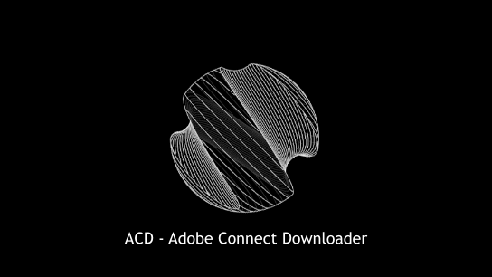

<a href="https://Bhttps://github.com/soroushamdg/acd/releases" style="text-align: center;">Download latest database version here</a>
<a href="https://github.com/soroushamdg/acd/blob/master/supported_schools.txt">Supported schools</a>
<h1 id="requirments">Requirments</h1>
<ul>
<li>Windows XP+</li>
<li>At least 100 MB RAM (just for extracting large files)(usually it uses only 30 to 40 MB of RAM)</li>
</ul>
<h1>Why ACD?</h1>
<h4>easy to answer, first of all, say goodbye to watching online those classes that you missed or watching for exams. it helps you to download and extract all voice and video data automated, add 5 sessions, go get a cup of tea and rest, it will make them ready for you. as easy as couple of clicks.</h4>
<h4>Also by multithreading I could make it possible to save much more time in downloading and extracting data. </h4>
<h1 id="usage">USAGE</h1>
<h2 id="installation-and-first-run">Installation and First run</h2>

1 - Download latest release file from <a href="https://github.com/soroushamdg/acd/releases">releases</a> page. 
2 - Extract files. 
3 - Goto <a href="https://ffmpeg.zeranoe.com/builds/">FFMPEG Binary Releases</a> page and download latest STATIC stable version of it. 

4 - After FFMPEG downloaded, extract it into folder.

5 - Extract ACD-Release.zip files.

6 - Run ACD-Launcher.

<h3 id="do-not-close-the-cmd-window">DO NOT CLOSE THE CMD WINDOW</h3>

7 - After launching it, it will open up file dialog, please choose “acd_sengine.acde” file.

8 - After loading the app, in Stage-1, click on first item and in opened dialog, locate to where you extracted FFMPEG and go into “bin” folder of FFMPEG and the select it.(it should show empty in bin folder)

9 - Close the app and launch it again.

10 - Open up the app again and in Stage-1, click on second item, then locate and open “database.acddb” file.

<h2 id="login-into-system">Login into system</h2>

After passing Stage-1(it’s one time thing), Stage-2 is now enabled for you. Select your university or school LMS link or if it’s not in the list, tell me in <a href="https://github.com/soroushamdg/acd/issues">request page</a> by “request school” label. 
After choosing your school, enter username and password then hit “Login”

<h3 id="everything-is-encrypted-by-aes-method.">everything is encrypted by AES method.</h3>
<h3 id="if-app-became-no-responding-its-ok.-just-wait.">if app became no responding, IT’S OK. Just wait.</h3>
<h2 id="downloading-files">Downloading files</h2>

If login in Stage-2 was successfull, now Stage-3 will be become enabled for you. Click on + button next to list and enter you session link into it (your session link is which is saved on your universities panel page). 
After entering links in list, hit start.

<h3 id="the-progressbar-may-not-show-download-progress.">-  the progressbar may not show download progress.</h3>
<h3 id="you-can-see-how-much-it-has-downloaded-in-cmd-window.">- you can see how much it has downloaded in cmd window.</h3>

After your download finished, it will extract files. 
to save time I made app to be multithreaded, while extracting downloaded file it will download next file. so in some point your computers performance may drop.

<h2 id="after-stage-3">After Stage-3</h2>

Your downloaded and extracted files will be saved in “exports” folder in your DESKTOP. 
After progress finished, you can add new links and download more sessions =D

<h1 id="how-it-works">How it works?</h1>

well I wasn’t in mood to draw all diagrams, maybe later @,@

<h1 id="report-a-bug">report a bug</h1>
<ul>
<li>if you saw a bug, catch it, then throw it into <a href="https://github.com/soroushamdg/acd/issues">issues page</a>.</li>
</ul>

<h2 id="Help">Help!</h2>
<h3> How to update database? </h3>
Just download latest version of database and copy and replace it on old one. as simple as it is.
 
 <h4> most of issues will go away by deleting setting's file and relaunching the app.
to delete settings file. 
"your windows drive, usally C" > ://Users/ "your-user" /AppData/Temp/
  Example : C://Users/John/AppData/Temp/ <h4>
 
 <h4>in following folder look for : settings.acds
  and delete the file :))</h4>
